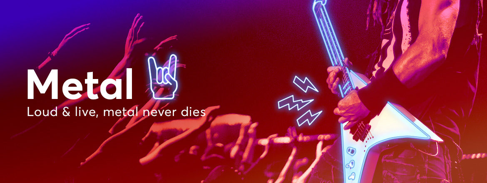

# Applied Data Science @ Columbia
## Fall 2019
## Project 1: A "data story" on the songs of our times



### [Project Description](doc/)
This is the first and only *individual* (as opposed to *team*) this semester. 

Term: Fall 2019

+ Projec title: Do we and our dad share the same "Metal"?
+ This project is conducted by [Ruozhou Zhang]

+ Project summary: [a short summary] Since its birth in the 1980s, metal music has spawned many, many genres, and some changes have also taken place. This report is about finding if there are differences between Metal from our dad's generation and from our generation. The whole project go through cleaning the raw data -"lyrics.csv", using math and sentiment analysis to calculate certain statistics and showing the result using worldcloud and other statistical plots.

+ Three questions will be answered in this report are:

    i.Is there a difference in word selection between Our Metal and Our Dad’s?

    ii.Is there a difference in lyrics emotion between Our Metal and Our Dad’s?

    iii.How did the changes gradually happened?

Following [suggestions](http://nicercode.github.io/blog/2013-04-05-projects/) by [RICH FITZJOHN](http://nicercode.github.io/about/#Team) (@richfitz). This folder is orgarnized as follows.

```
proj/
├── lib/
├── data/
├── doc/
├── figs/
└── output/
```

Please see each subfolder for a README file.
