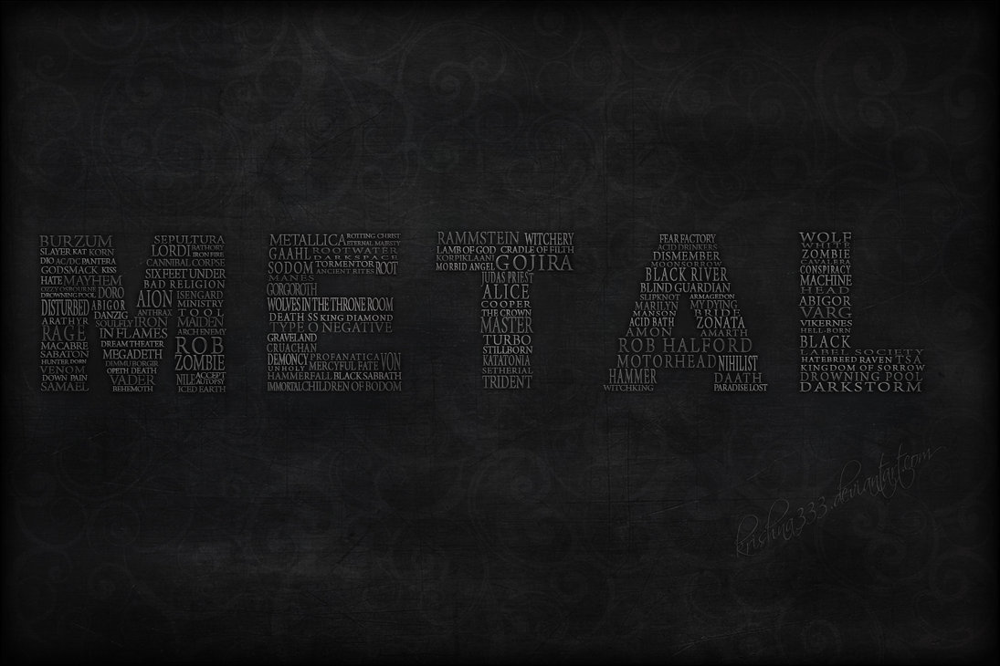

```{r setup, include=FALSE}
knitr::opts_chunk$set(echo = TRUE)
```


[Reference: GoogleImage](https://www.google.com/imgres?imgurl=https%3A%2F%2F2nx1mv3iav9j16tlyt2hv5ki-wpengine.netdna-ssl.com%2Fwp-content%2Fuploads%2FPage-Assets-2019%2FMetal_Guide_Header_1170x440-1170x440.jpg&imgrefurl=https%3A%2F%2Fguides.ticketmaster.co.uk%2Fconcerts-and-tours-guide%2Fmetal%2F&tbnid=-ceb716OEE8t6M&vet=10CCYQMyh2ahcKEwi4it2QobTnAhUAAAAAHQAAAAAQCQ..i&docid=cmzX07nmksePnM&w=1170&h=440&q=Metal%20music&ved=0CCYQMyh2ahcKEwi4it2QobTnAhUAAAAAHQAAAAAQCQ)

My Dad and I are both huge fun of Metal Music. I got $《And$ $justice$ $for$ $all》$, the fourth album of Metallica as my 13-year-old birthday present. Though I know $Metallica$ is one of the most influential heavy metal bands of all time and they are kind of the legend of Metal, But I still found it is weirdly different from recent Metal Albums. So when I was given this data, the first thing I want to know is whether there is a significant difference between the Metal music from my dad's generation and those from mine.
  
"lyrics.csv" is a filtered corpus of 380,000+ song lyrics from from MetroLyrics. You can read more about it on [Kaggle](https://www.kaggle.com/gyani95/380000-lyrics-from-metrolyrics).And I am using the cleaned data of $lyrics.csv$ using Text_Processing_a_little_change in the $doc$ file

```{r load libraries, warning=FALSE, message=FALSE, echo=FALSE}
#This buntch of code is from the tutorial in class
packages.used <- c("tidyverse", "tidyr", "wordcloud", "tm", "RColorBrewer", "tidytext", "sentimentr")

# check packages that need to be installed.
packages.needed=setdiff(packages.used, 
                        intersect(installed.packages()[,1], 
                                  packages.used))

# install additional packages
if(length(packages.needed)>0){
  install.packages(packages.needed, dependencies = TRUE)
}

# load packages
library("tidyverse")
library("tidyr")
library("wordcloud")
library("RColorBrewer")
library("sentimentr")
library("tidytext")
```

### Data Processing
I cleaned the data $lyrics.csv$ by removing the punctuations, meaningless word using the **Text_Processing_a_little_change.Rmd** in $doc$ file, which is originally provided by the instructor but with some light change made by me. I store the processed data as **my_processed_lyrics.RData** in the $output$ file.

Then I select the Metal songs from **1985 to 1995**, which is the period that my Dad's generation started to listening to Music, and Metal songs from **2010 to 2016**, which is the period that my generation listening to Music. 

Using these data, I began my analysis.
```{r, echo=FALSE}
# load lyrics data
load('../output/my_processed_lyrics.RData')

# We don't care about "Other" and "Not Available" genre class
data <- dt_lyrics %>% 
  filter(genre != "Other" & genre != "Not Available") %>% 
  select(-c(lyrics, id))

# Select the songs from my dad's generation(1985-1995), and the songs from my generation(2000-2016)
dt_dad <- data %>% 
  filter(year >= 1985 & year <= 1995)
dt_my <- data %>% 
  filter(year > 2010 & year <= 2016)
```

### Question 1: Is there a difference in word selection between Our Metal and Our Dad's?

I began with the word-based analysis.  

By calculation the word frequency in the lyrics from the two generations, I was been able to draw these two wordcloud graphs and their frequent bar plot correspondingly.

#### The word composition of lyrics can be different in these to generations
From these two wordcloud, we can see that Metal music from our dad's generation tends to talk more about **"Love"**, **"Death"**, **"Sky"**, **"Night"**, whereas those from our generation mainly focus on **"Time"**, **"Life"** and **"World"**. Maybe we youth are just becoming more sensitive to how big our world is and how fast the time passes by.

#### The diversity of lyrics is Much Smaller in our time
Also, we can sadly say that the diveristy of word in the Metal lyrics is much smaller in our age. In our dad's generation the **top4** used word in lyrics all have nearly 1% appearence, whereas in our time **only the top1** used word appeared more than 1% of all words in the lyrics. I wonder if it is we audience or musicians are becoming more superficial than the old days?

```{r, echo=FALSE}
# select the Metal Music from My Dad's Generation and My Generation, and calculate the word frequency
# Input a dataframe contain the words of songs, f.word_freq can return a dataframe that contains the word and their frequency from a given genre.

source("../lib/f.word_freq.R")

dt_dad_Q1 <- f.word_freq(dt_dad, "Metal")
dt_my_Q1 <- f.word_freq(dt_my, "Metal")

```

```{r, warning=FALSE, echo=FALSE, out.width='50%'}
# Find the most frequently used word in the two Generations
dt_dad_top10 <- dt_dad_Q1 %>%
  mutate(freq = (count / sum(count)) * 100) %>% 
  head(10)

dt_my_top10 <- dt_my_Q1 %>% 
  mutate(freq = (count / sum(count)) * 100) %>% 
  head(10)

# Draw the bar plot to show it more explicitly
dt_dad_top10 %>% 
  mutate(word = reorder(word, freq)) %>% 
  ggplot(aes(word, freq))+
  geom_col(fill = "red")+
  coord_flip()+
  labs(y = "Freq(%)",
       title = "Metal Lyrics From Dad's generation(1985-1995)")+
  theme(plot.title = element_text(size=22))

dt_my_top10 %>% 
  mutate(word = reorder(word, freq)) %>% 
  ggplot(aes(word, freq))+
  geom_col(fill = "blue")+
  coord_flip()+
  labs(y = "Freq(%)",
       title = "Metal Lyrics From our generation(2010-2016)")+
  theme(plot.title = element_text(size=22))
```


```{r, warning=FALSE, fig.height=6, fig.width=6, echo=FALSE, out.width='50%'}
# Here is the WordCloud graph for Metal in Dad's generation
wordcloud(dt_dad_Q1$word,
          dt_dad_Q1$count,
          scale=c(5,0.5),
          max.words=100,
          min.freq=1,
          random.order=FALSE,
          rot.per=0.3,
          use.r.layout=T,
          random.color=FALSE,
          colors=brewer.pal(9,"Reds"))

# Here is the WordCloud graph for Metal in Our generation
wordcloud(dt_my_Q1$word,
          dt_my_Q1$count,
          scale=c(5,0.5),
          max.words=100,
          min.freq=1,
          random.order=FALSE,
          rot.per=0.3,
          use.r.layout=T,
          random.color=FALSE,
          colors=brewer.pal(9,"Blues"))
```


### Question 2: Is there a difference in lyrics emotion between Our Metal and Our Dad's?

We now know there are some differences in word selection and diversity of the Metal music between our time and our dads'. So the next thing is: What about the emotion of the songs? 

I applied **Sentiment Analysis** using [NRC Sentiment Lexion](http://saifmohammad.com/WebPages/NRC-Emotion-Lexicon.htm) to do this. As it may take a long time to generate the emotion matrix, so I write another script **Q2_data_preparing** in the $doc$ file to generate the eomtion matrix of the two generation and save as **data1_for_Q2.RData**(emotion matrix of Our dad's generation) and **data2_for_Q2.RData**(emotion matrix of Our generation) in the $output$ file. We are using these intermediate computational results to find the answer of question 2.

#### The emotion composition did not change much
From the pie plot, we can tell that though the percent of **"Joy"** becomes lower, **"Fear"**, **"Saddness"** and **"Anticipation"** is always the three dominate emotion of Metal(Just like the BIG III of Metal).

#### The emotion of Metal lyrics tend to be more diversified
We can also tell that the diversity of the emotion changed a little bit. This confirms the fact that Metal music is becoming more and more sourced these decades.

```{r, warning=FALSE, echo=FALSE}
#To save the time for reproducting, I am using data1_for_Q2 and data2_for_Q2 in the ouput file, these two data are generated by Q2_data_preparing.Rmd in the lib file.

load("../output/data1_for_Q2.RData")
load("../output/data2_for_Q2.Rdata")

```

```{r, warning=FALSE, echo=FALSE}
# Input a dataframe contains the emotion matrix for a certain group of music, f.tidy_emo can return a dataframe that contains the frequent of all certain emotion appeared in this group of songs..
source("../lib/f.tidy_emo.R")

emotion_dad_mat <- f.tidy_emo(emotion_dad)
emotion_my_mat <- f.tidy_emo(emotion_my)

```

```{r, out.width='50%', echo = FALSE}
myLab_1 <- c(emotion_dad_mat$Emotion)
myLab_1 <- paste0(myLab_1, "(", round(emotion_dad_mat$Freq / sum(emotion_dad_mat$Freq) * 100, 2), "%)", sep = "")
myLab_2 <- c(emotion_my_mat$Emotion)
myLab_2 <- paste0(myLab_2, "(", round(emotion_my_mat$Freq / sum(emotion_my_mat$Freq) * 100, 2), "%)", sep = "")

emotion_dad_mat %>% 
  mutate(Emotion = factor(Emotion, levels = emotion_dad_mat$Emotion)) %>% 
  ggplot(aes(x = "", y = Freq, fill = Emotion))+
  geom_bar(stat = "identity",
           position = "stack",
           width = 1)+
  coord_polar(theta = "y")+
  labs(x = "", y = "",
       title = "Emotion Composition of Dad's time")+
  scale_fill_discrete(breaks = emotion_dad_mat$Emotion, labels = myLab_1)+
  theme(axis.ticks = element_blank(),
        axis.text.x = element_blank(),
        panel.grid = element_blank(),
        panel.border = element_blank(),
        plot.title = element_text(size=22),
        legend.text = element_text(size = 15))

emotion_my_mat %>% 
  mutate(Emotion = factor(Emotion, levels = emotion_my_mat$Emotion)) %>% 
  ggplot(aes(x = "", y = Freq, fill = Emotion))+
  geom_bar(stat = "identity",
           position = "stack",
           width = 1)+
  coord_polar(theta = "y")+
  labs(x = "", y = "",
       title = "Emotion Composition of our time")+
  scale_fill_discrete(breaks = emotion_my_mat$Emotion, labels = myLab_2)+
  theme(axis.ticks = element_blank(),
        axis.text.x = element_blank(),
        panel.grid = element_blank(),
        panel.border = element_blank(),
        plot.title = element_text(size=22),
        legend.text = element_text(size = 15))

```

### Question 3: How did the changes gradually happened?
As we know that the choice of word in Metal lyrics changed significantly in recent years, whereas the emotional structure of lyrics has not changed much, then how the change happened is the third question.

To do this, I track the word that appeared in either top10-word from my dad's generation or top10-word from my generation and see how these words' percentage changed over these years. For convenience, I divided the time from my dad's generation(1985-1995) to my generation(2010-2016) into three five-years-periods, and track these words' percentage in these periods.

As we can tell from the plot below, over these years, the word **"Time"**, **"World"** and **"Live"** appeared in the Metal songs more and more frequently. And although still in the top-favorable -word-list, **"Night"**, **"Baby"**, **"Sky"**, **"Dearth"** and **"Body"**'s appearence are keep going down in Metal. The most interesting part is that despite its popularity in 1995, the word **"love"** was gradually abandoned by metal musicians.

```{r, echo=FALSE}
track_word <- unique(c(dt_my_top10$word, dt_dad_top10$word))

dt_dad_Q3 <- dt_dad %>%
  f.word_freq(gen = "Metal") %>% 
  mutate(freq = (count / sum(count)) * 100) %>% 
  filter(word %in% track_word) %>% 
  select(word, freq)

dt_95_00 <- data %>% 
  filter(year > 1995 & year <= 2000) %>% 
  f.word_freq(gen = "Metal") %>% 
  mutate(freq = (count / sum(count)) * 100) %>% 
  filter(word %in% track_word) %>% 
  select(word, freq)

dt_00_05 <- data %>% 
  filter(year > 2000 & year <= 2005) %>% 
  f.word_freq(gen = "Metal") %>% 
  mutate(freq = (count / sum(count)) * 100) %>% 
  filter(word %in% track_word) %>% 
  select(word, freq)

dt_05_10 <- data %>% 
  filter(year > 2005 & year <= 2010) %>% 
  f.word_freq(gen = "Metal") %>% 
  mutate(freq = (count / sum(count)) * 100) %>% 
  filter(word %in% track_word) %>% 
  select(word, freq)

dt_my_Q3 <- dt_my %>%
  f.word_freq(gen = "Metal") %>% 
  mutate(freq = (count / sum(count)) * 100) %>% 
  filter(word %in% track_word) %>%
  select(word, freq)
  
dt_Q3 <- inner_join(dt_dad_Q3, dt_95_00, by = "word") %>% 
  inner_join(dt_00_05, by = "word") %>% 
  inner_join(dt_05_10, by = "word") %>% 
  inner_join(dt_my_Q3, by = "word")

colnames(dt_Q3) <- c("word","dad's generation", "1995-2000", "2000-2005", "2005-2010", "my generation")

dt_Q3 <- dt_Q3 %>% 
  gather(("dad's generation": "my generation"),
         key = "period",
         value = "Freq") %>% 
  mutate(word = factor(word, levels = track_word)) %>% 
  mutate(period = factor(period, levels = c("dad's generation", "1995-2000", "2000-2005", "2005-2010", "my generation")))


ggplot(dt_Q3)+
  geom_line(aes(x = period, y = Freq, color = word, group = word))+
  facet_wrap(~ word, nrow = 4)+
  theme(axis.text.x = element_text(angle = 45, vjust = 0.5))
  
```

### Conclusion
After all these, we know that:

###### I. The choice of word in Metal lyrics are different between our time and our dad's time and wording for Metal lyrics is getting scarce.

###### II. The Emotion that Metal musicians tend to express has a tendency to diversify, but the ovrall change is not large.

###### III. the word **"love"** was gradually abandoned by metal musicians

